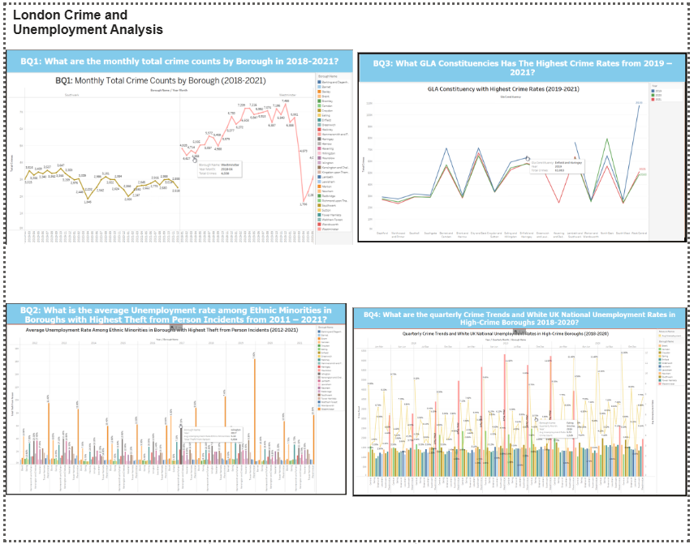

London Crime and Unemployment Analysis
Built an end-to-end big-data analytics warehouse integrating London crime, unemployment and geographic datasets using R, HDFS, Hive and HiveQL, with Kimball-style modelling and Tableau reporting.
1.	153,689 crime records processed
2.	238,986 analysis-ready rows
3.	261 duplicates identified
4.	95,463 null values detected
5.	5 analytical HiveQL outputs
6.	32 London boroughs analysed

Project Overview
The project investigates crime trends across London boroughs and explores how these patterns relate to unemployment and geographic factors. The analysis was designed around five business questions covering borough-level crime counts, unemployment indicators, GLA constituencies, quarterly crime trends, and common crime types.

The project follows a full data analytics pipeline:
1. Data extraction from crime, unemployment, and geographic datasets.
2. Data cleaning and transformation using R.
3. Data loading into HDFS and Hive.
4. Data warehouse modelling using a Kimball bottom-up approach.
5. HiveQL queries to answer business questions.
6. Tableau dashboard visualisation.
7. Final recommendations based on analytical findings.

## Tools and Technologies

- R / RStudio
- Apache Hive
- HDFS
- SQL / HiveQL
- Tableau
- Data Warehousing
- Kimball Bottom-Up Approach
- Agile Methodology

## Datasets Used

The project uses three datasets:

- London crime dataset
- London unemployment dataset
- London geographic dataset

The datasets were joined using `Borough_Code` as the common key.

## Business Questions

1. What is the total number of crimes per borough in each month from 2018 to 2021?
2. What is the average unemployment rate among ethnic minority UK nationals across boroughs with the highest theft-from-person incidents?
3. Which GLA constituencies are linked to boroughs with the highest crime rates?
4. What are the highest occurring crime types in each quarter and their corresponding unemployment rates?
5. What are the highest occurring crime types in each borough?

## dashboard_overview Image

